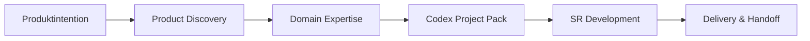

# Aurora SR Method Codex Pack

[](https://github.com/syl2042/Aurora_SR_method_codex_pack/stargazers)
[](https://github.com/syl2042/Aurora_SR_method_codex_pack/forks)
[](https://github.com/syl2042/Aurora_SR_method_codex_pack/issues)
[](https://github.com/syl2042/Aurora_SR_method_codex_pack/commits/main)
[](LICENSE)

[English](README.md) · [Français](README.fr.md) · **DE** · [Português](README.pt.md) · [Español](README.es.md)

[⭐ Repository mit Stern markieren](https://github.com/syl2042/Aurora_SR_method_codex_pack/stargazers) ·
[Dokumentation](https://docs.auroramind.fr/docs/SR_Method) ·
[Installation](INSTALLATION.de.md) ·
[Mit Codex installieren](prompts/de/00_install_codex_environment.md) ·
[Aktualisieren](prompts/de/05_upgrade_codex_environment.md) ·
[Prüfen](prompts/de/06_verify_sr_installation.md)

---

## Was ist das?

**Aurora SR Method Codex Pack** ist ein öffentliches Pack, mit dem die **SR Method** in einem Softwareprojekt installiert wird, damit Codex in einem expliziten, überprüfbaren und übertragbaren Rahmen arbeitet.

**SR** bedeutet **Specification Runtime**.

Die zentrale Idee ist einfach:

> **Die KI ist in der Exploration frei, aber in der Ausführung begrenzt.**

Codex kann analysieren, diagnostizieren, vorschlagen und vergleichen. Sobald Codex jedoch eine Datei ändern, eine Abhängigkeit anpassen, eine Migration erstellen, Konfiguration berühren, zu GitHub pushen oder eine fachliche Entscheidung treffen soll, muss es in einem validierten Umfang arbeiten, mit Belegen, Prüfungen und einer wiederaufnehmbaren Erinnerung.

```text
Pack klonen
-> Prompt in Codex einfügen
-> SR Method im Zielprojekt installieren
-> Installation prüfen
-> In gesteuerten Lots arbeiten
-> Testen, dokumentieren, übergeben
```

---

## Warum dieses Pack nutzen?

Codex ist leistungsfähig, kann aber in echten Projekten schnell riskant werden, wenn der Kontext unklar ist:

- es codet, bevor es die Quellen gelesen hat;
- es verwechselt Hypothese und geprüfte Tatsache;
- es erweitert den Umfang ohne Validierung;
- es vergisst frühere Entscheidungen;
- es schließt ein Lot ohne echten Benutzertest;
- es lässt sich in einer neuen Sitzung schwer wieder aufnehmen.

Die SR Method bringt Projektdisziplin: **klares Ziel, gelesene Quellen, kurze Lots, Validierungsgates, SR-Verträge, Task-Memory und sauberer Handoff**.

Sie macht Codex zu einem zuverlässigeren Entwicklungskollegen: nicht zu einem einmaligen Codegenerator, sondern zu einem Agenten, der methodisch im Repository arbeitet.

---

## Für wen?

Dieses Pack richtet sich hauptsächlich an:

| Profil | Abgedeckter Bedarf |
|---|---|
| Solo-Entwickler | Codex auch über mehrere lange Sitzungen hinweg kontrollieren. |
| Tech Lead | Standardisieren, wie Codex liest, ändert, prüft und dokumentiert. |
| SaaS-Gründer | Ein Produkt schnell voranbringen, ohne Vision, Scope und Entscheidungen zu verlieren. |
| KI-Trainer / Berater | Eine reproduzierbare Methode für KI-gestützte Entwicklung zeigen. |
| Produkt-Tech-Team | Codex-Arbeit auditierbar, testbar und übertragbar machen. |

---

## Was die SR Method konkret ändert

### Ohne SR-Rahmen

```text
Breiter Prompt
-> Codex interpretiert
-> Codex ändert
-> Abschlusszusammenfassung
-> Schwer zu erkennen, was bewiesen, getestet oder noch riskant ist
```

### Mit SR-Rahmen

```text
Benutzerintention
-> Quellen lesen
-> Umfang vorschlagen
-> Menschliche Validierung
-> Kurzes Lot
-> SR Gates
-> Prüfungen
-> Benutzer-E2E-Tests
-> Wiederaufnehmbare Erinnerung
-> Handoff
```

---

## Die Schlüsselprinzipien

### 1. Prompt-first

Der empfohlene Weg ist nicht, Skripte manuell auszuführen.

Sie öffnen Codex im Zielprojekt, fügen den passenden Prompt ein, dann inspiziert Codex das Repository, schlägt den Umfang vor, fragt nach Validierung und führt bei Bedarf nützliche Skripte aus.

### 2. Evidence before action

Vor jeder Aktion muss Codex die verfügbaren Quellen lesen: SR-Dateien, realen Code, Tests, Logs, offizielle Dokumentation, RepoMap oder Knowledge Graph, falls vorhanden.

### 3. Kurze und überprüfbare Lots

Die Entwicklung wird in benannte, begrenzte und nachvollziehbare Lots aufgeteilt.

Ein Lot ist nicht `done`, nur weil Codex mit dem Coden fertig ist. Es wird `done`, wenn die vorgesehenen Prüfungen und, falls nötig, Benutzer-E2E-Tests validiert sind.

### 4. Explizite menschliche Validierung

Codex kann frei analysieren. Sensible Aktionen erfordern jedoch Validierung: Dateiänderung, Abhängigkeitsänderung, Migration, GitHub-Push, Konfiguration, Secret, Geschäftsregel oder Produktentscheidung.

### 5. Wiederaufnehmbare Erinnerung

Jede wichtige Sitzung muss verwertbare Spuren hinterlassen: aktueller Zustand, Entscheidungen, gelesene Quellen, geänderte Dateien, Prüfungen, verbleibende Risiken und nächster Resume-Prompt.

---

## Was sich in 3.0.4 ändert

Version `3.0.4` stärkt SR für strukturelle Funktionen, die während der Entwicklung entstehen.

Wenn eine neue Funktion, Reparatur oder Entdeckung mehr als das aktuelle Lot betreffen kann, muss Codex jetzt:

- das **Backlog Mutation Gate** anwenden, um zu entscheiden, ob `SR_INBOX.yaml` oder `SR_LOTS.yaml` aktualisiert werden muss;
- das **Global Impact Gate** vor dem Coden anwenden und Auswirkungen auf Produktabläufe, Daten, Berechtigungen, APIs/Services, UI, Tests, Migrationen, Risiken und bestehende Lots prüfen;
- die **Lot Dependency Reconciliation** ausführen, um betroffene Lots als `impacted`, `blocked_by`, `reopened`, `superseded`, `split_required`, `depends_on` oder `unaffected` zu klassifizieren;
- `no_backlog_mutation_required` dokumentieren, wenn keine Backlog-Änderung nötig ist.

So bleibt SR projektagnostisch und verhindert zugleich, dass wichtige Querschnittsauswirkungen implizit bleiben.

---

## Der vollständige Workflow



| Schritt | Ziel | Erwartete Ausgabe |
|---|---|---|
| **1. Product Discovery** | Bedarf vor dem Code klären. | Produktvision, Zielgruppe, V0, Ausschlüsse, Risiken. |
| **2. Domain Expertise** | Verhindern, dass Codex den Fachbereich wie generisches CRUD behandelt. | Vokabular, kritische Regeln, Quellen der Wahrheit, LLM-Risiken. |
| **3. Codex Project Pack** | Discovery in ein für Codex nutzbares Dossier verwandeln. | Brief, PRD, Specs, Architektur, Datenmodell, API, UX, Tests, erste Lots. |
| **4. SR Development** | Codex in kontrollierten Lots im Repository arbeiten lassen. | Ausgeführtes, geprüftes, dokumentiertes und testbares Lot. |
| **5. Delivery & Handoff** | Sauber liefern und Wiederaufnahme ermöglichen. | E2E-Tests, SR-Memory, Verträge, Risiken, nächster Schritt. |

---

## Schnellstart mit Codex

### 1. Dieses Repository klonen

```bash
git clone https://github.com/syl2042/Aurora_SR_method_codex_pack.git
```

### 2. Codex im Zielprojekt öffnen

Wechseln Sie in das Repository der Anwendung, in der Sie die SR Method installieren möchten.

### 3. Installationsprompt einfügen

Nutzen Sie den deutschen Prompt:

- [00_install_codex_environment.md](prompts/de/00_install_codex_environment.md)

Codex muss:

1. das Projekt inspizieren;
2. prüfen, ob SR bereits installiert ist;
3. nur die erwarteten SR-Dateien installieren;
4. keinen Anwendungscode ändern;
5. die Prüfungen ausführen;
6. einen Abschlussbericht erzeugen;
7. vor jeder Anwendungsentwicklung stoppen.

### 4. Installation prüfen

Empfohlener Prompt:

- [06_verify_sr_installation.md](prompts/de/06_verify_sr_installation.md)

### 5. Eine SR-Sitzung starten

Empfohlener Prompt:

- [01_start_sr_session.md](prompts/de/01_start_sr_session.md)

---

## Wichtige Prompts

| Aktion | Prompt |
|---|---|
| SR Method installieren | [00_install_codex_environment.md](prompts/de/00_install_codex_environment.md) |
| SR-Sitzung starten | [01_start_sr_session.md](prompts/de/01_start_sr_session.md) |
| SR Method aktualisieren | [05_upgrade_codex_environment.md](prompts/de/05_upgrade_codex_environment.md) |
| Installation prüfen | [06_verify_sr_installation.md](prompts/de/06_verify_sr_installation.md) |
| Zustand nach Upgrade neu ausrichten | [07_realign_sr_state_after_upgrade.md](prompts/07_realign_sr_state_after_upgrade.md) |
| Runtime-KI-Agenten definieren | [15_define_runtime_agents.md](prompts/de/15_define_runtime_agents.md) |

---

## Kurzer Prompt zum Rahmen eines Lots

```text
Rahme diesen Bedarf als SR-Lot.

Code nichts.

Gib mir:
- das überprüfbare Ziel;
- den eingeschlossenen Umfang;
- den ausgeschlossenen Umfang;
- die Annahmen;
- die zu lesenden Quellen;
- Kandidatendateien;
- Risiken;
- geplante Prüfungen;
- Benutzer-E2E-Tests;
- den empfohlenen Lot-Status.

Warte vor jeder Änderung auf meine Validierung.
```

---

## Arbeiten in Lots

Das Lot ist die zentrale Arbeitseinheit der SR Method.

```text
proposed -> planned -> validated -> in_progress -> user_testing -> done
```

Bei Problemen:

```text
user_testing -> reopened -> in_progress -> user_testing -> done
```

| Status | Bedeutung |
|---|---|
| `proposed` | Idee oder Feedback, das gerahmt werden muss. |
| `planned` | Strukturiertes, aber noch nicht validiertes Lot. |
| `validated` | Vom Benutzer validiertes und ausführbares Lot. |
| `in_progress` | Codex führt das Lot aus. |
| `user_testing` | Code ist geliefert, aber ein echter Benutzertest steht aus. |
| `done` | Lot ist gemäß den geplanten Kriterien geprüft und validiert. |
| `reopened` | Lot nach Bug, Auslassung oder Regression wieder geöffnet. |
| `blocked` | Lot durch Entscheidung, Zugriff oder fehlende Quelle blockiert. |
| `superseded` | Lot durch anderes Lot oder Entscheidung ersetzt. |

---

## SR Gates

Ein **Gate** ist eine Kontrolle, die verhindert, dass Codex auf Annahmen weiterarbeitet oder ohne Beleg liefert.

| Gate | Zweck |
|---|---|
| **Evidence Gate** | Quellen vor der Planung prüfen. |
| **Fact Gate** | Unbewiesene Schlussfolgerungen verhindern. |
| **Knowledge Gate** | Änderungskarte aus RepoMap, KG oder realem Code erstellen. |
| **Scope Gate** | Strikt im validierten Umfang bleiben. |
| **Verification Gate** | Beweisen, dass die Änderung funktioniert, oder erklären, warum Prüfung unmöglich ist. |
| **Design Gate** | UI/UX-Qualität kontrollieren, wenn die Oberfläche betroffen ist. |
| **Context Budget Gate** | Kontextverlust verhindern und Wiederaufnahme vorbereiten. |

Beispiel für einen guten Fact-Gate-Reflex:

```text
Ich kann ohne Beleg nicht schließen.
Ich muss die betroffene Datei, Logs, Tests oder offizielle Dokumentation lesen, bevor ich die Ursache behaupte.
```

---

## Was das Pack in einem Zielprojekt installiert

Nach der Installation kann das Zielprojekt insbesondere enthalten:

```text
AGENTS.md
docs/CURRENT_STATE.md
docs/codex/SR_BOOTSTRAP.md
docs/codex/PROJECT_PROFILE.yaml
docs/codex/SKILL_DIGEST.md
docs/codex/SKILL_MAP.md
docs/codex/SR_LOTS.yaml
docs/codex/SR_INBOX.yaml
docs/codex/CODEBASE_MAP.md
docs/codex/tasks/
docs/codex/project-skills/
scripts/codex/
```

Diese Dateien orientieren Codex, strukturieren Lots, erhalten Memory, validieren Verträge und bereiten Wiederaufnahmen vor.

Sie ersetzen niemals das Lesen des realen Codes: **Code, Tests und Logs entscheiden**.

---

## Inhalt des öffentlichen Repositorys

Dieses Repository ist ein **öffentliches Source-Pack**. Es soll geklont und anschließend in Zielprojekten installiert werden.

```text
core/             Kanonischer englischer Methodenkern und Templates
prompts/          Root-Prompts und mehrsprachige Einstiegspunkte
scripts/          Installations-, Audit- und Validierungsskripte
skills-method/    Wiederverwendbare Codex Method Skills
blueprints/       Templates für Lots, Inbox, Tasks und Skills
profiles/         Generische Installationsprofile
project-skills/   Modellort für lokale Projektskills
adr/              ADR-Template
tasks/_TEMPLATE/  Task-Memory-Template
```

Das öffentliche Repository darf keine zustandsbezogenen Dateien eines Zielprojekts veröffentlichen:

```text
AGENTS.md
DESIGN.md
docs/CURRENT_STATE.md
docs/codex/
docs/codex/tasks/
tasks/
*.docx
lokale Handoffs
Kundenpfade
Projektdaten
Secrets
```

---

## SR-Verträge

Die SR Method nutzt Verträge, um zu prüfen, ob die Schleife eingehalten wurde.

| Vertrag | Beantwortete Frage |
|---|---|
| `loop_contract.json` | Hat Codex die SR-Schleife korrekt angewendet? |
| `sr_contract.json` | Sind alle validierten Benutzeranfragen abgedeckt oder explizit aus dem Lot ausgeschlossen? |

Ein Lot darf nicht auf `done` gehen, wenn eine validierte Anfrage ohne klare Behandlung offen bleibt.

Typische Validierungsbefehle:

```bash
python3 scripts/codex/validate_loop_contract.py --file docs/codex/tasks/YYYY-MM-DD_slug/loop_contract.json
python3 scripts/codex/validate_sr_contract.py --file docs/codex/tasks/YYYY-MM-DD_slug/sr_contract.json
```

---

## Codex Skills

Die Methode unterscheidet drei Skill-Familien.

### Method Skills

Sie rahmen die Arbeitsweise:

- Diagnose;
- Planung;
- Architektur;
- TDD;
- Diff-Review;
- RepoMap-Pflege;
- Lot-Ausführung;
- Optimierung des Terminalkontexts.

### Domain Skills

Sie beschreiben einen bestimmten Fachbereich, damit Codex die Regeln nicht erfindet.

Eine gute Domain Skill enthält:

- Fachvokabular;
- nicht verhandelbare Regeln;
- Quellen der Wahrheit;
- wahrscheinliche LLM-Fehler;
- erwartete Patterns;
- Anti-Patterns;
- Checkliste vor Abschluss.

### Runtime Skills

Sie gehören zu KI-Agenten in Anwendungen. Sie beschreiben versionierbare Verhaltensweisen, die von einem Runtime geladen werden: vorsichtige Diagnose, Support-Antworten, Eskalation, Qualitätsprüfung, Markenton usw.

---

## SR Agent Method

Die **SR Agent Method** ist eine optionale Erweiterung zum Entwerfen von KI-Agenten, die in Fachanwendungen integriert sind.

Sie ist kein Framework und ersetzt nicht LangChain, LangGraph, LlamaIndex, PydanticAI, CrewAI oder Agent-SDKs.

Sie definiert den **Anwendungsvertrag** des Agenten vor der Implementierung:

- Rolle;
- Eingaben;
- Ausgaben;
- Berechtigungen;
- erlaubte Daten;
- nutzbare Tools;
- Validierungen;
- Logs;
- Risiken;
- Aktivierungsstatus.

Starkes Prinzip:

> Von einem LLM erzeugtes JSON ist keine verlässliche Anwendungsdatenstruktur, solange es nicht backendseitig validiert wurde.

Empfohlener Ablauf:

```text
Typisiertes Modell
-> JSON Schema für das LLM
-> JSON-Antwort des LLM
-> strikte Runtime-Validierung
-> akzeptiertes Anwendungsobjekt oder kontrollierter Fehler
```

In Python muss die Validierung auf **Pydantic** oder einem gleichwertigen Validator basieren.

Vorsichtsregeln:

- kein freies SQL, das vom LLM generiert und ausgeführt wird;
- strukturierte und validierte Anwendungsausgaben;
- kritische Aktionen unter menschlicher Validierung;
- Agent standardmäßig inaktiv, bis sein Vertrag validiert ist.

---

## SR Core Modus und SR Nexus KG Modus

Die SR Method kann auf zwei Ebenen arbeiten.

| Modus | Beschreibung |
|---|---|
| **SR Core** | Codex stützt sich auf SR-Dateien, RepoMap und direkte Codelektüre. |
| **SR Nexus KG** | Ein Nexus Knowledge Graph hilft, Dateien, Routen, Komponenten, Services, Abhängigkeiten, Tests und Risikozonen zu identifizieren. |

In beiden Fällen gilt dasselbe Prinzip:

> Graph oder Karte leiten die Suche, aber der reale Code entscheidet.

---

## Technische Fallback-Befehle

Der normale Ablauf ist **prompt-first**. Die folgenden Befehle sind für Fallback, Audit oder Automatisierung nützlich.

### Aus lokaler Quelle installieren

```bash
export SR_PACK_SOURCE="$HOME/aurora-sr-method-pack"

git clone https://github.com/syl2042/Aurora_SR_method_codex_pack.git "$SR_PACK_SOURCE"

python3 "$SR_PACK_SOURCE/scripts/install_codex_pack.py" \
  --source "$SR_PACK_SOURCE" \
  --target /path/to/project \
  --profile default \
  --write
```

### Source-Pack prüfen

Aus diesem Repository:

```bash
python3 scripts/codex/verify_codex_pack.py
python3 scripts/codex/audit_codex_pack.py --root . --json
git diff --check
```

### Installiertes Projekt prüfen

Aus dem Zielprojekt, je nach vorhandenen Dateien:

```bash
python3 scripts/codex/verify_codex_pack.py
python3 scripts/codex/audit_codex_pack.py --json
python3 scripts/codex/sr_post_install_check.py --root . --json
python3 scripts/codex/find_next_session_prompt.py --root . --json
python3 scripts/codex/audit_sr_project.py --root . --json
python3 scripts/codex/validate_lot_contract.py --file docs/codex/SR_LOTS.yaml
python3 scripts/codex/audit_sr_task_contracts.py --root . --json
git diff --check
git status --short
```

---

## Hygiene vor öffentlicher Veröffentlichung

Vor der Veröffentlichung eines Forks oder Releases prüfen, dass keine Zielprojektdaten versehentlich enthalten sind.

```bash
git ls-tree -r --name-only HEAD | grep -E '(^docs/codex/|^tasks/|\.docx$|^AGENTS.md$|^DESIGN.md$|CURRENT_STATE)'
git grep -n -I -E 'absolute_path|customer_project|client_project|internal_project' HEAD -- .
```

Diese Befehle dürfen keinen Veröffentlichungsblocker zurückgeben.

---

## Sprachrichtlinie

Der technische Kern der SR Method bleibt in **kanonischem Englisch** gepflegt, damit eine stabile und kohärente Basis erhalten bleibt.

Entwickler-Einstiegspunkte sind in mehreren Sprachen verfügbar:

- README;
- Installationsanleitungen;
- kopierbare Codex-Prompts;
- Prompts für Aktualisierung, Prüfung, Wiederaufnahme und Runtime-Agenten.

Ein installiertes Projekt kann Codex anweisen, mit dem Benutzer auf Deutsch zu sprechen. Die technische Methode bleibt kanonisch Englisch.

---

## Was dieses Pack nicht ist

Dieses Pack ist nicht:

- ein agentisches Framework;
- ein automatischer Anwendungsgenerator ohne Aufsicht;
- eine Garantie, dass Codex nie Fehler macht;
- ein Ersatz für Tests;
- ein Ersatz für Produktvalidierung;
- ein Tool, das KI erlaubt, Geschäftsregeln allein zu entscheiden.

Es ist eine Methode kontrollierter Ausführung, um KI-gestützte Entwicklung zuverlässiger, auditierbarer und leichter wiederaufnehmbar zu machen.

---

## Dokumentation

Hauptdokumentation:

- [SR Method](https://docs.auroramind.fr/docs/SR_Method)
- [Englische Dokumentation](https://docs.auroramind.fr/docs/SR_Method/en)

Nützliche Seiten:

- SR Method verstehen
- Mit Codex starten
- In Lots arbeiten
- Gates und Validierung
- Codex Skills
- Codex Project Pack
- Wichtige SR-Dateien
- SR-Verträge
- Runtime-KI-Agenten
- Abschluss, E2E-Tests und GitHub

---

## Lizenz

Dieses Repository wird unter der **MIT**-Lizenz veröffentlicht.

Siehe [LICENSE](LICENSE).

---

## Beitragen

Beiträge sind willkommen, wenn sie die Methode stärken, ohne sie schwerer zu machen.

Nützliche Bereiche:

- mehrsprachige Prompts verbessern;
- Prüfchecklisten hinzufügen;
- Lot-Templates erweitern;
- Audit-Skripte verbessern;
- echte Anwendungsfälle dokumentieren;
- wiederverwendbare Method- oder Domain-Skills vorschlagen.

Vor jeder Contribution gilt die Projektphilosophie:

> weniger Improvisation, mehr Belege, bessere Wiederaufnahme.
