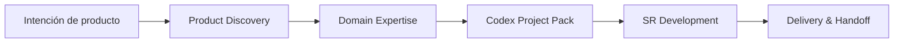

# Aurora SR Method Codex Pack

[](https://github.com/syl2042/Aurora_SR_method_codex_pack/stargazers)
[](https://github.com/syl2042/Aurora_SR_method_codex_pack/forks)
[](https://github.com/syl2042/Aurora_SR_method_codex_pack/issues)
[](https://github.com/syl2042/Aurora_SR_method_codex_pack/commits/main)
[](LICENSE)

[English](README.md) · [Français](README.fr.md) · [Deutsch](README.de.md) · [Português](README.pt.md) · **ES**

[⭐ Dar una estrella](https://github.com/syl2042/Aurora_SR_method_codex_pack/stargazers) ·
[Documentación](https://docs.auroramind.fr/docs/SR_Method) ·
[Instalación](INSTALLATION.es.md) ·
[Instalar con Codex](prompts/es/00_install_codex_environment.md) ·
[Actualizar](prompts/es/05_upgrade_codex_environment.md) ·
[Verificar](prompts/es/06_verify_sr_installation.md)

---

## Qué es

**Aurora SR Method Codex Pack** es un pack público para instalar la **SR Method** en un proyecto de software, para que Codex trabaje dentro de un marco explícito, verificable y transmisible.

**SR** significa **Specification Runtime**.

La idea central es simple:

> **La IA es libre en exploración, pero limitada en ejecución.**

Codex puede analizar, diagnosticar, proponer y comparar. Pero, en cuanto debe modificar un archivo, cambiar una dependencia, crear una migración, tocar configuración, hacer push a GitHub o tomar una decisión de negocio, debe trabajar dentro de un alcance validado, con evidencias, verificaciones y memoria de reanudación.

```text
Clonar el pack
-> Pegar un prompt en Codex
-> Instalar la SR Method en el proyecto destino
-> Verificar la instalación
-> Trabajar por lots gobernados
-> Probar, documentar, transmitir
```

---

## Por qué usar este pack

Codex es potente, pero en un proyecto real puede volverse riesgoso cuando el contexto es confuso:

- programa antes de leer las fuentes;
- confunde hipótesis con hechos verificados;
- amplía el alcance sin validación;
- olvida decisiones anteriores;
- cierra un lot sin prueba real de usuario;
- se vuelve difícil de retomar en una nueva sesión.

La SR Method aporta disciplina de trabajo de proyecto: **objetivo claro, fuentes leídas, lots cortos, gates de validación, contratos SR, task memory y handoff limpio**.

Convierte a Codex en un compañero de desarrollo más fiable: no un generador de código puntual, sino un agente que trabaja en el repositorio con método.

---

## Para quién

Este pack se dirige principalmente a:

| Perfil | Necesidad cubierta |
|---|---|
| Desarrollador solo | Mantener el control sobre Codex, incluso en varias sesiones largas. |
| Tech lead | Estandarizar cómo Codex lee, modifica, verifica y documenta. |
| Fundador SaaS | Hacer avanzar rápido un producto sin perder visión, alcance y decisiones. |
| Formador / consultor IA | Mostrar un método reproducible para desarrollo asistido por IA. |
| Equipo producto-tech | Hacer el trabajo de Codex auditable, testeable y transmisible. |

---

## Qué cambia concretamente la SR Method

### Sin marco SR

```text
Prompt amplio
-> Codex interpreta
-> Codex modifica
-> Resumen final
-> Difícil saber qué está probado, testeado o todavía riesgoso
```

### Con marco SR

```text
Intención del usuario
-> Lectura de fuentes
-> Alcance propuesto
-> Validación humana
-> Lot corto
-> Gates SR
-> Verificaciones
-> Tests E2E de usuario
-> Memoria de reanudación
-> Handoff
```

---

## Principios clave

### 1. Prompt-first

El recorrido recomendado no es ejecutar scripts manualmente.

Abres Codex en el proyecto destino, pegas el prompt adecuado, luego Codex inspecciona el repositorio, propone el alcance, pide validación y ejecuta los scripts útiles cuando sea necesario.

### 2. Evidence before action

Antes de actuar, Codex debe leer las fuentes disponibles: archivos SR, código real, tests, logs, documentación oficial, RepoMap o Knowledge Graph si está disponible.

### 3. Lots cortos y verificables

El desarrollo se divide en lots nombrados, acotados y trazables.

Un lot no está `done` porque Codex terminó de programar. Pasa a `done` cuando las verificaciones previstas y, si es necesario, los tests E2E de usuario están validados.

### 4. Validación humana explícita

Codex puede analizar libremente. Pero las acciones sensibles requieren validación: modificación de archivo, cambio de dependencia, migración, push GitHub, configuración, secreto, regla de negocio o decisión de producto.

### 5. Memoria de reanudación

Cada sesión importante debe dejar rastros utilizables: estado actual, decisiones, fuentes leídas, archivos modificados, verificaciones, riesgos restantes y próximo prompt de reanudación.

---

## Qué cambia en 3.0.4

La versión `3.0.4` refuerza SR para funciones estructurantes que aparecen durante el desarrollo.

Cuando una nueva función, reparación o descubrimiento puede afectar más que el lot actual, Codex ahora debe:

- aplicar el **Backlog Mutation Gate** para decidir si `SR_INBOX.yaml` o `SR_LOTS.yaml` debe actualizarse;
- aplicar el **Global Impact Gate** antes de programar, revisando impacto en flujos de producto, datos, permisos, APIs/servicios, UI, tests, migraciones, riesgos y lots existentes;
- ejecutar la **Lot Dependency Reconciliation** para clasificar lots afectados como `impacted`, `blocked_by`, `reopened`, `superseded`, `split_required`, `depends_on` o `unaffected`;
- documentar `no_backlog_mutation_required` cuando no haga falta cambiar el backlog.

Así, SR sigue siendo agnóstica al proyecto y evita que impactos transversales importantes queden implícitos.

---

## Workflow completo



| Etapa | Objetivo | Salida esperada |
|---|---|---|
| **1. Product Discovery** | Aclarar la necesidad antes del código. | Visión de producto, target, V0, exclusiones, riesgos. |
| **2. Domain Expertise** | Evitar que Codex trate el dominio como CRUD genérico. | Vocabulario, reglas críticas, fuentes de verdad, riesgos LLM. |
| **3. Codex Project Pack** | Transformar la discovery en un dossier utilizable por Codex. | Brief, PRD, specs, arquitectura, data model, API, UX, tests, lots iniciales. |
| **4. SR Development** | Hacer que Codex trabaje por lots controlados dentro del repo. | Lot ejecutado, verificado, documentado y testeable. |
| **5. Delivery & Handoff** | Entregar limpiamente y permitir la reanudación. | Tests E2E, memoria SR, contratos, riesgos, siguiente paso. |

---

## Inicio rápido con Codex

### 1. Clonar este repositorio

```bash
git clone https://github.com/syl2042/Aurora_SR_method_codex_pack.git
```

### 2. Abrir Codex en el proyecto destino

Sitúate en el repositorio de la aplicación donde quieres instalar la SR Method.

### 3. Pegar el prompt de instalación

Usa el prompt en español:

- [00_install_codex_environment.md](prompts/es/00_install_codex_environment.md)

Codex debe:

1. inspeccionar el proyecto;
2. verificar si SR ya está instalada;
3. instalar únicamente los archivos SR esperados;
4. no modificar código aplicativo;
5. ejecutar las verificaciones;
6. producir un informe final;
7. detenerse antes de cualquier desarrollo aplicativo.

### 4. Verificar la instalación

Prompt recomendado:

- [06_verify_sr_installation.md](prompts/es/06_verify_sr_installation.md)

### 5. Iniciar una sesión SR

Prompt recomendado:

- [01_start_sr_session.md](prompts/es/01_start_sr_session.md)

---

## Prompts principales

| Acción | Prompt |
|---|---|
| Instalar la SR Method | [00_install_codex_environment.md](prompts/es/00_install_codex_environment.md) |
| Iniciar una sesión SR | [01_start_sr_session.md](prompts/es/01_start_sr_session.md) |
| Actualizar la SR Method | [05_upgrade_codex_environment.md](prompts/es/05_upgrade_codex_environment.md) |
| Verificar la instalación | [06_verify_sr_installation.md](prompts/es/06_verify_sr_installation.md) |
| Realinear el estado tras upgrade | [07_realign_sr_state_after_upgrade.md](prompts/07_realign_sr_state_after_upgrade.md) |
| Definir agentes IA runtime | [15_define_runtime_agents.md](prompts/es/15_define_runtime_agents.md) |

---

## Ejemplo de prompt corto para encuadrar un lot

```text
Encuadra esta necesidad como un lot SR.

No programes nada.

Dame:
- el objetivo verificable;
- el alcance incluido;
- el fuera de alcance;
- las hipótesis;
- las fuentes a leer;
- los archivos candidatos;
- los riesgos;
- las verificaciones previstas;
- los tests E2E de usuario;
- el estado recomendado del lot.

Espera mi validación antes de cualquier modificación.
```

---

## Trabajar por lots

El lot es la unidad central de trabajo de la SR Method.

```text
proposed -> planned -> validated -> in_progress -> user_testing -> done
```

En caso de problema:

```text
user_testing -> reopened -> in_progress -> user_testing -> done
```

| Estado | Significado |
|---|---|
| `proposed` | Idea o feedback por encuadrar. |
| `planned` | Lot estructurado, pero aún no validado. |
| `validated` | Lot validado por el usuario y ejecutable. |
| `in_progress` | Codex ejecuta el lot. |
| `user_testing` | El código está entregado, pero falta prueba real de usuario. |
| `done` | El lot está verificado y validado según los criterios previstos. |
| `reopened` | Lot reabierto tras bug, omisión o regresión. |
| `blocked` | Lot bloqueado por decisión, acceso o fuente faltante. |
| `superseded` | Lot reemplazado por otro lot o decisión. |

---

## Gates SR

Un **gate** es un control que impide que Codex avance sobre suposiciones o entregue sin evidencia.

| Gate | Objetivo |
|---|---|
| **Evidence Gate** | Verificar fuentes antes de planificar. |
| **Fact Gate** | Impedir conclusiones no probadas. |
| **Knowledge Gate** | Construir el mapa del cambio desde RepoMap, KG o código real. |
| **Scope Gate** | Permanecer estrictamente dentro del alcance validado. |
| **Verification Gate** | Probar que el cambio funciona o explicar por qué la verificación es imposible. |
| **Design Gate** | Controlar la calidad UI/UX cuando la interfaz está implicada. |
| **Context Budget Gate** | Prevenir pérdida de contexto y preparar la reanudación. |

Ejemplo de buen reflejo Fact Gate:

```text
No puedo concluir sin evidencia.
Debo leer el archivo relevante, logs, tests o documentación oficial antes de afirmar la causa.
```

---

## Qué instala el pack en un proyecto destino

Después de la instalación, el proyecto destino puede contener:

```text
AGENTS.md
docs/CURRENT_STATE.md
docs/codex/SR_BOOTSTRAP.md
docs/codex/PROJECT_PROFILE.yaml
docs/codex/SKILL_DIGEST.md
docs/codex/SKILL_MAP.md
docs/codex/SR_LOTS.yaml
docs/codex/SR_INBOX.yaml
docs/codex/CODEBASE_MAP.md
docs/codex/tasks/
docs/codex/project-skills/
scripts/codex/
```

Estos archivos orientan a Codex, estructuran lots, conservan memoria, validan contratos y preparan reanudaciones.

Nunca sustituyen la lectura del código real: **el código, los tests y los logs deciden**.

---

## Contenido del repositorio público

Este repositorio es un **pack fuente público**. Está destinado a clonarse y luego instalarse en proyectos destino.

```text
core/             Núcleo canónico en inglés y plantillas
prompts/          Prompts raíz y entradas multilingües
scripts/          Scripts de instalación, auditoría y validación
skills-method/    Skills método Codex reutilizables
blueprints/       Plantillas de lots, inbox, tasks y skills
profiles/         Perfiles genéricos de instalación
project-skills/   Ubicación modelo para skills locales de proyecto
adr/              Plantilla ADR
tasks/_TEMPLATE/  Plantilla de memoria de tarea
```

El repositorio público no debe publicar archivos de estado propios de un proyecto destino:

```text
AGENTS.md
DESIGN.md
docs/CURRENT_STATE.md
docs/codex/
docs/codex/tasks/
tasks/
*.docx
handoffs locales
rutas de cliente
datos de proyecto
secretos
```

---

## Contratos SR

La SR Method usa contratos para verificar que el bucle se ha respetado.

| Contrato | Pregunta respondida |
|---|---|
| `loop_contract.json` | ¿Codex aplicó correctamente el bucle SR? |
| `sr_contract.json` | ¿Todas las solicitudes validadas del usuario están cubiertas o explícitamente fuera del lot? |

Un lot no debe pasar a `done` si una solicitud validada queda abierta sin tratamiento claro.

Comandos típicos de validación:

```bash
python3 scripts/codex/validate_loop_contract.py --file docs/codex/tasks/YYYY-MM-DD_slug/loop_contract.json
python3 scripts/codex/validate_sr_contract.py --file docs/codex/tasks/YYYY-MM-DD_slug/sr_contract.json
```

---

## Skills Codex

El método distingue tres familias de skills.

### Skills método

Encuadran la manera de trabajar:

- diagnóstico;
- planificación;
- arquitectura;
- TDD;
- revisión de diff;
- mantenimiento de RepoMap;
- ejecución de lots;
- optimización del contexto terminal.

### Skills de dominio

Describen un dominio específico para evitar que Codex invente las reglas.

Una buena skill de dominio contiene:

- vocabulario de dominio;
- reglas no negociables;
- fuentes de verdad;
- errores probables de un LLM;
- patterns esperados;
- anti-patterns;
- checklist antes del cierre.

### Skills runtime

Pertenecen a agentes IA aplicativos. Describen comportamientos versionables cargados por un runtime: diagnóstico prudente, redacción de soporte, escalado, revisión de calidad, tono de marca, etc.

---

## SR Agent Method

La **SR Agent Method** es una extensión opcional para diseñar agentes IA integrados en aplicaciones de negocio.

No es un framework y no reemplaza LangChain, LangGraph, LlamaIndex, PydanticAI, CrewAI ni los SDK de agentes.

Sirve para definir el **contrato aplicativo** del agente antes de su implementación:

- rol;
- entradas;
- salidas;
- permisos;
- datos autorizados;
- tools utilizables;
- validaciones;
- logs;
- riesgos;
- estado de activación.

Principio fuerte:

> Un JSON producido por un LLM no es un dato aplicativo fiable mientras no haya sido validado del lado backend.

Flujo recomendado:

```text
Modelo tipado
-> JSON Schema expuesto al LLM
-> respuesta JSON del LLM
-> validación runtime estricta
-> objeto aplicativo aceptado o error controlado
```

En Python, la validación debe apoyarse en **Pydantic** o un validador equivalente.

Reglas de prudencia:

- ningún SQL libre generado y ejecutado por el LLM;
- salidas aplicativas estructuradas y validadas;
- acciones críticas sometidas a validación humana;
- agente inactivo por defecto hasta que su contrato esté validado.

---

## Modo SR Core y modo SR Nexus KG

La SR Method puede funcionar en dos niveles.

| Modo | Descripción |
|---|---|
| **SR Core** | Codex se apoya en archivos SR, RepoMap y lectura directa del código. |
| **SR Nexus KG** | Un Knowledge Graph Nexus ayuda a identificar archivos, rutas, componentes, servicios, dependencias, tests y zonas de riesgo. |

En ambos casos, el principio sigue siendo el mismo:

> El grafo o el mapa orientan la búsqueda, pero el código real decide.

---

## Comandos técnicos de fallback

El recorrido normal es **prompt-first**. Los comandos siguientes son útiles como fallback, auditoría o automatización.

### Instalar desde una fuente local

```bash
export SR_PACK_SOURCE="$HOME/aurora-sr-method-pack"

git clone https://github.com/syl2042/Aurora_SR_method_codex_pack.git "$SR_PACK_SOURCE"

python3 "$SR_PACK_SOURCE/scripts/install_codex_pack.py" \
  --source "$SR_PACK_SOURCE" \
  --target /path/to/project \
  --profile default \
  --write
```

### Verificar el pack fuente

Desde este repositorio:

```bash
python3 scripts/codex/verify_codex_pack.py
python3 scripts/codex/audit_codex_pack.py --root . --json
git diff --check
```

### Verificar un proyecto instalado

Desde el proyecto destino, según los archivos presentes:

```bash
python3 scripts/codex/verify_codex_pack.py
python3 scripts/codex/audit_codex_pack.py --json
python3 scripts/codex/sr_post_install_check.py --root . --json
python3 scripts/codex/find_next_session_prompt.py --root . --json
python3 scripts/codex/audit_sr_project.py --root . --json
python3 scripts/codex/validate_lot_contract.py --file docs/codex/SR_LOTS.yaml
python3 scripts/codex/audit_sr_task_contracts.py --root . --json
git diff --check
git status --short
```

---

## Higiene antes de publicación pública

Antes de publicar un fork o una release, verifica que ningún dato de proyecto destino se haya incluido por error.

```bash
git ls-tree -r --name-only HEAD | grep -E '(^docs/codex/|^tasks/|\.docx$|^AGENTS.md$|^DESIGN.md$|CURRENT_STATE)'
git grep -n -I -E 'absolute_path|customer_project|client_project|internal_project' HEAD -- .
```

Estos comandos no deben devolver ningún bloqueo de publicación.

---

## Política de idioma

El núcleo técnico de la SR Method se mantiene en **inglés canónico** para conservar una base estable y coherente.

Los puntos de entrada para desarrolladores están disponibles en varios idiomas:

- README;
- guías de instalación;
- prompts Codex para copiar y pegar;
- prompts de actualización, verificación, reanudación y agentes runtime.

Un proyecto instalado puede pedir a Codex que hable con el usuario en español. El método técnico sigue siendo canónico en inglés.

---

## Qué no es este pack

Este pack no es:

- un framework agentic;
- un generador automático de aplicación sin supervisión;
- una garantía de que Codex nunca cometerá errores;
- un reemplazo de los tests;
- un reemplazo de la validación de producto;
- una herramienta que autoriza a la IA a decidir sola reglas de negocio.

Es un método de ejecución controlada para hacer que el desarrollo asistido por IA sea más fiable, más auditable y más fácil de retomar.

---

## Documentación

Documentación principal:

- [SR Method](https://docs.auroramind.fr/docs/SR_Method)
- [Documentación en inglés](https://docs.auroramind.fr/docs/SR_Method/en)

Páginas útiles:

- Entender la SR Method
- Empezar con Codex
- Trabajar por lots
- Gates y validación
- Skills Codex
- Codex Project Pack
- Archivos SR principales
- Contratos SR
- Agentes IA runtime
- Cierre, tests E2E y GitHub

---

## Licencia

Este repositorio está publicado bajo licencia **MIT**.

Ver [LICENSE](LICENSE).

---

## Contribuir

Las contribuciones son bienvenidas si fortalecen el método sin volverlo más pesado.

Áreas útiles:

- mejorar prompts multilingües;
- añadir checklists de verificación;
- enriquecer plantillas de lots;
- mejorar scripts de auditoría;
- documentar casos de uso reales;
- proponer skills método o dominio reutilizables.

Antes de contribuir, ten presente la filosofía del proyecto:

> menos improvisación, más evidencias, más reanudación.
