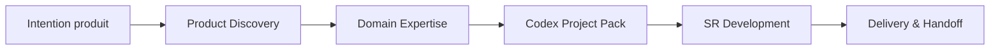

# Aurora SR Method Codex Pack

[](https://github.com/syl2042/Aurora_SR_method_codex_pack/stargazers)
[](https://github.com/syl2042/Aurora_SR_method_codex_pack/forks)
[](https://github.com/syl2042/Aurora_SR_method_codex_pack/issues)
[](https://github.com/syl2042/Aurora_SR_method_codex_pack/commits/main)
[](LICENSE)

**FR** · [English](README.md) · [Deutsch](README.de.md) · [Português](README.pt.md) · [Español](README.es.md)

[⭐ Mettre une étoile](https://github.com/syl2042/Aurora_SR_method_codex_pack/stargazers) ·
[Documentation](https://docs.auroramind.fr/docs/SR_Method) ·
[Installation](INSTALLATION.fr.md) ·
[Installer avec Codex](prompts/fr/00_install_codex_environment.md) ·
[Mettre à jour](prompts/fr/05_upgrade_codex_environment.md) ·
[Vérifier](prompts/fr/06_verify_sr_installation.md)

---

## Ce que c'est

**Aurora SR Method Codex Pack** est un pack public permettant d'installer la **SR Method** dans un projet logiciel afin de faire travailler Codex dans un cadre explicite, vérifiable et transmissible.

**SR** signifie **Specification Runtime**.

L'idée centrale est simple :

> **L'IA est libre en exploration, mais contrainte en exécution.**

Codex peut analyser, diagnostiquer, proposer et comparer. En revanche, dès qu'il doit modifier un fichier, changer une dépendance, créer une migration, toucher une configuration, pousser sur GitHub ou prendre une décision métier, il doit travailler dans un périmètre validé, avec des preuves, des vérifications et une mémoire de reprise.

```text
Cloner le pack
-> Coller un prompt dans Codex
-> Installer la SR Method dans le projet cible
-> Vérifier l'installation
-> Travailler par lots gouvernés
-> Tester, documenter, transmettre
```

---

## Pourquoi utiliser ce pack ?

Codex est puissant, mais sur un vrai projet il peut vite devenir risqué si le contexte est flou :

- il code avant d'avoir lu les sources ;
- il confond hypothèse et fait vérifié ;
- il élargit le périmètre sans validation ;
- il oublie les décisions précédentes ;
- il termine un lot sans test utilisateur réel ;
- il devient difficile à reprendre dans une nouvelle session.

La SR Method apporte une discipline de travail projet : **objectif clair, sources lues, lots courts, gates de validation, contrats SR, task memory et handoff propre**.

Elle transforme Codex en coéquipier de développement plus fiable : pas un simple générateur de code ponctuel, mais un agent qui travaille dans le repo avec méthode.

---

## Pour qui ?

Ce pack s'adresse principalement :

| Profil | Besoin couvert |
|---|---|
| Développeur solo | Garder le contrôle sur Codex, même sur plusieurs sessions longues. |
| Tech lead | Standardiser la manière dont Codex lit, modifie, vérifie et documente. |
| Fondateur SaaS | Faire avancer vite un produit sans perdre la vision, le scope et les décisions. |
| Formateur / consultant IA | Montrer une méthode reproductible pour le développement assisté par IA. |
| Équipe produit-tech | Rendre le travail de Codex auditable, testable et transmissible. |

---

## Ce que la SR Method change concrètement

### Sans cadre SR

```text
Prompt large
-> Codex interprète
-> Codex modifie
-> Résumé final
-> Difficile de savoir ce qui est prouvé, testé ou encore risqué
```

### Avec cadre SR

```text
Intention utilisateur
-> Lecture des sources
-> Périmètre proposé
-> Validation humaine
-> Lot court
-> Gates SR
-> Vérifications
-> Tests E2E utilisateur
-> Mémoire de reprise
-> Handoff
```

---

## Les principes clés

### 1. Prompt-first

Le parcours recommandé n'est pas d'exécuter les scripts à la main.

Vous ouvrez Codex dans le projet cible, vous collez le prompt adapté, puis Codex inspecte le dépôt, propose le périmètre, demande validation et lance les scripts utiles lorsque c'est nécessaire.

### 2. Evidence before action

Avant d'agir, Codex doit lire les sources disponibles : fichiers SR, code réel, tests, logs, documentation officielle, RepoMap ou Knowledge Graph si disponible.

### 3. Lots courts et vérifiables

Le développement est découpé en lots nommés, bornés et traçables.

Un lot n'est pas `done` parce que Codex a fini de coder. Il devient `done` quand les vérifications prévues et, si nécessaire, les tests E2E utilisateur sont validés.

### 4. Validation humaine explicite

Codex peut analyser librement. Mais les actions sensibles exigent validation : modification de fichier, changement de dépendance, migration, push GitHub, configuration, secret, règle métier ou décision produit.

### 5. Mémoire de reprise

Chaque session importante doit laisser une trace exploitable : état courant, décisions, sources lues, fichiers modifiés, vérifications, risques restants et prochain prompt de reprise.

---

## Le workflow complet



| Étape | Objectif | Sortie attendue |
|---|---|---|
| **1. Product Discovery** | Clarifier le besoin avant le code. | Vision produit, cible, V0, exclusions, risques. |
| **2. Domain Expertise** | Éviter que Codex traite le métier comme un CRUD générique. | Vocabulaire, règles critiques, sources de vérité, risques LLM. |
| **3. Codex Project Pack** | Transformer la discovery en dossier exploitable par Codex. | Brief, PRD, specs, architecture, data model, API, UX, tests, lots initiaux. |
| **4. SR Development** | Faire travailler Codex par lots contrôlés dans le repo. | Lot exécuté, vérifié, documenté, testable. |
| **5. Delivery & Handoff** | Livrer proprement et permettre la reprise. | Tests E2E, mémoire SR, contrats, risques, prochaine étape. |

---

## Démarrage rapide avec Codex

### 1. Cloner ce repository

```bash
git clone https://github.com/syl2042/Aurora_SR_method_codex_pack.git
```

### 2. Ouvrir Codex dans le projet cible

Placez-vous dans le repository de l'application sur laquelle vous voulez installer la SR Method.

### 3. Coller le prompt d'installation

Utilisez le prompt français :

- [00_install_codex_environment.md](prompts/fr/00_install_codex_environment.md)

Codex doit :

1. inspecter le projet ;
2. vérifier si SR est déjà installée ;
3. installer uniquement les fichiers SR attendus ;
4. ne modifier aucun code applicatif ;
5. exécuter les vérifications ;
6. produire un rapport final ;
7. stopper avant tout développement applicatif.

### 4. Vérifier l'installation

Prompt recommandé :

- [06_verify_sr_installation.md](prompts/fr/06_verify_sr_installation.md)

### 5. Démarrer une session SR

Prompt recommandé :

- [01_start_sr_session.md](prompts/fr/01_start_sr_session.md)

---

## Prompts principaux

| Action | Prompt |
|---|---|
| Installer la SR Method | [00_install_codex_environment.md](prompts/fr/00_install_codex_environment.md) |
| Démarrer une session SR | [01_start_sr_session.md](prompts/fr/01_start_sr_session.md) |
| Mettre à jour la SR Method | [05_upgrade_codex_environment.md](prompts/fr/05_upgrade_codex_environment.md) |
| Vérifier l'installation | [06_verify_sr_installation.md](prompts/fr/06_verify_sr_installation.md) |
| Réaligner l'état après upgrade | [07_realign_sr_state_after_upgrade.md](prompts/07_realign_sr_state_after_upgrade.md) |
| Définir des agents IA runtime | [15_define_runtime_agents.md](prompts/fr/15_define_runtime_agents.md) |

---

## Exemple de prompt court pour cadrer un lot

```text
Cadre ce besoin comme un lot SR.

Ne code rien.

Donne-moi :
- l'objectif vérifiable ;
- le périmètre inclus ;
- le hors périmètre ;
- les hypothèses ;
- les sources à lire ;
- les fichiers candidats ;
- les risques ;
- les vérifications prévues ;
- les tests E2E utilisateur ;
- le statut recommandé du lot.

Attends ma validation avant toute modification.
```

---

## Travailler par lots

Le lot est l'unité de travail centrale de la SR Method.

```text
proposed -> planned -> validated -> in_progress -> user_testing -> done
```

En cas de problème :

```text
user_testing -> reopened -> in_progress -> user_testing -> done
```

| Statut | Signification |
|---|---|
| `proposed` | Idée ou retour à cadrer. |
| `planned` | Lot structuré, mais non encore validé. |
| `validated` | Lot validé par l'utilisateur et exécutable. |
| `in_progress` | Codex exécute le lot. |
| `user_testing` | Le code est livré, mais le test réel utilisateur est attendu. |
| `done` | Le lot est vérifié et validé selon les critères prévus. |
| `reopened` | Le lot est rouvert après bug, oubli ou régression. |
| `blocked` | Le lot est bloqué par une décision, un accès ou une source manquante. |
| `superseded` | Le lot est remplacé par un autre lot ou une décision. |

---

## Les gates SR

Un **gate** est un contrôle qui empêche Codex d'avancer sur une supposition ou de livrer sans preuve.

| Gate | But |
|---|---|
| **Evidence Gate** | Vérifier les sources avant de planifier. |
| **Fact Gate** | Empêcher les conclusions non prouvées. |
| **Knowledge Gate** | Construire la carte du changement depuis RepoMap, KG ou code réel. |
| **Scope Gate** | Rester strictement dans le périmètre validé. |
| **Verification Gate** | Prouver que le changement fonctionne ou expliquer pourquoi la vérification est impossible. |
| **Design Gate** | Contrôler la qualité UI/UX lorsque l'interface est concernée. |
| **Context Budget Gate** | Prévenir la perte de contexte et préparer la reprise. |

Exemple de bon réflexe Fact Gate :

```text
Je ne peux pas conclure sans preuve.
Je dois lire le fichier concerné, les logs, les tests ou la documentation officielle avant d'affirmer la cause.
```

---

## Ce que le pack installe dans un projet cible

Après installation, le projet cible peut contenir notamment :

```text
AGENTS.md
docs/CURRENT_STATE.md
docs/codex/SR_BOOTSTRAP.md
docs/codex/PROJECT_PROFILE.yaml
docs/codex/SKILL_DIGEST.md
docs/codex/SKILL_MAP.md
docs/codex/SR_LOTS.yaml
docs/codex/SR_INBOX.yaml
docs/codex/CODEBASE_MAP.md
docs/codex/tasks/
docs/codex/project-skills/
scripts/codex/
```

Ces fichiers servent à orienter Codex, structurer les lots, garder la mémoire, valider les contrats et préparer les reprises.

Ils ne remplacent jamais la lecture du code réel : **le code, les tests et les logs tranchent**.

---

## Contenu du repository public

Ce repository est un **pack source public**. Il est destiné à être cloné, puis installé dans des projets cibles.

```text
core/             Coeur méthode et templates en anglais canonique
prompts/          Prompts racine et entrées multilingues
scripts/          Scripts d'installation, audit et validation
skills-method/    Skills méthode Codex réutilisables
blueprints/       Templates de lots, inbox, tasks et skills
profiles/         Profils génériques d'installation
project-skills/   Emplacement modèle pour les skills locales projet
adr/              Template ADR
tasks/_TEMPLATE/  Mémoire de tâche modèle
```

Le repository public ne doit pas publier les fichiers d'état propres à un projet cible :

```text
AGENTS.md
DESIGN.md
docs/CURRENT_STATE.md
docs/codex/
docs/codex/tasks/
tasks/
*.docx
handoffs locaux
chemins client
données projet
secrets
```

---

## Contrats SR

La SR Method utilise des contrats pour vérifier que la boucle a été respectée.

| Contrat | Question traitée |
|---|---|
| `loop_contract.json` | Codex a-t-il appliqué correctement la boucle SR ? |
| `sr_contract.json` | Toutes les demandes utilisateur validées sont-elles couvertes ou explicitement sorties du lot ? |

Un lot ne doit pas passer en `done` si une demande validée reste ouverte sans traitement clair.

Commandes de validation typiques :

```bash
python3 scripts/codex/validate_loop_contract.py --file docs/codex/tasks/YYYY-MM-DD_slug/loop_contract.json
python3 scripts/codex/validate_sr_contract.py --file docs/codex/tasks/YYYY-MM-DD_slug/sr_contract.json
```

---

## Skills Codex

La méthode distingue trois familles de skills.

### Skills méthode

Elles encadrent la manière de travailler :

- diagnostic ;
- planification ;
- architecture ;
- TDD ;
- revue de diff ;
- maintien de RepoMap ;
- exécution de lots ;
- optimisation du contexte terminal.

### Skills métier

Elles décrivent un domaine spécifique pour éviter que Codex invente les règles.

Une bonne skill métier contient :

- vocabulaire métier ;
- règles non négociables ;
- sources de vérité ;
- erreurs probables d'un LLM ;
- patterns attendus ;
- anti-patterns ;
- checklist avant clôture.

### Skills runtime

Elles appartiennent aux agents IA applicatifs. Elles décrivent des comportements versionnables chargés par un runtime : diagnostic prudent, rédaction support, escalade, revue qualité, ton de marque, etc.

---

## SR Agent Method

La **SR Agent Method** est une extension optionnelle pour concevoir des agents IA intégrés dans des applications métier.

Elle n'est pas un framework et ne remplace pas LangChain, LangGraph, LlamaIndex, PydanticAI, CrewAI ou les SDK agents.

Elle sert à définir le **contrat applicatif** de l'agent avant son implémentation :

- rôle ;
- entrées ;
- sorties ;
- permissions ;
- données autorisées ;
- tools utilisables ;
- validations ;
- logs ;
- risques ;
- statut d'activation.

Principe fort :

> Un JSON produit par un LLM n'est pas une donnée applicative fiable tant qu'il n'a pas été validé côté backend.

Flux recommandé :

```text
Modèle typé
-> JSON Schema exposé au LLM
-> réponse JSON du LLM
-> validation runtime stricte
-> objet applicatif accepté ou erreur contrôlée
```

En Python, la validation doit s'appuyer sur **Pydantic** ou un validateur équivalent.

Règles de prudence :

- aucun SQL libre généré puis exécuté par le LLM ;
- sorties applicatives structurées et validées ;
- actions critiques soumises à validation humaine ;
- agent inactif par défaut tant que son contrat n'est pas validé.

---

## Mode SR Core et mode SR Nexus KG

La SR Method peut fonctionner en deux niveaux.

| Mode | Description |
|---|---|
| **SR Core** | Codex s'appuie sur les fichiers SR, RepoMap et la lecture directe du code. |
| **SR Nexus KG** | Un Knowledge Graph Nexus aide à identifier fichiers, routes, composants, services, dépendances, tests et zones à risque. |

Dans les deux cas, le principe reste le même :

> Le graphe ou la carte orientent la recherche, mais le code réel tranche.

---

## Commandes techniques de secours

Le parcours normal est **prompt-first**. Les commandes ci-dessous sont utiles en secours, audit ou automatisation.

### Installer depuis une source locale

```bash
export SR_PACK_SOURCE="$HOME/aurora-sr-method-pack"

git clone https://github.com/syl2042/Aurora_SR_method_codex_pack.git "$SR_PACK_SOURCE"

python3 "$SR_PACK_SOURCE/scripts/install_codex_pack.py" \
  --source "$SR_PACK_SOURCE" \
  --target /path/to/project \
  --profile default \
  --write
```

### Vérifier le pack source

Depuis ce repository :

```bash
python3 scripts/codex/verify_codex_pack.py
python3 scripts/codex/audit_codex_pack.py --root . --json
git diff --check
```

### Vérifier un projet installé

Depuis le projet cible, selon les fichiers présents :

```bash
python3 scripts/codex/verify_codex_pack.py
python3 scripts/codex/audit_codex_pack.py --json
python3 scripts/codex/sr_post_install_check.py --root . --json
python3 scripts/codex/find_next_session_prompt.py --root . --json
python3 scripts/codex/audit_sr_project.py --root . --json
python3 scripts/codex/validate_lot_contract.py --file docs/codex/SR_LOTS.yaml
python3 scripts/codex/audit_sr_task_contracts.py --root . --json
git diff --check
git status --short
```

---

## Hygiène avant publication publique

Avant de publier un fork ou une release, vérifier qu'aucune donnée de projet cible n'a été incluse par erreur.

```bash
git ls-tree -r --name-only HEAD | grep -E '(^docs/codex/|^tasks/|\.docx$|^AGENTS.md$|^DESIGN.md$|CURRENT_STATE)'
git grep -n -I -E 'absolute_path|customer_project|client_project|internal_project' HEAD -- .
```

Ces commandes ne doivent retourner aucun blocage de publication.

---

## Politique de langue

Le coeur technique de la SR Method reste maintenu en **anglais canonique** afin de conserver une base stable et cohérente.

Les points d'entrée développeur sont disponibles en plusieurs langues :

- README ;
- guides d'installation ;
- prompts Codex à copier-coller ;
- prompts de mise à jour, vérification, reprise et agents runtime.

Un projet installé peut demander à Codex d'échanger avec l'utilisateur en français. La méthode technique reste canonique en anglais.

---

## Ce que ce pack n'est pas

Ce pack n'est pas :

- un framework agentique ;
- un générateur automatique d'application sans supervision ;
- une garantie que Codex ne fera jamais d'erreur ;
- un remplacement des tests ;
- un remplacement de la validation produit ;
- un outil qui autorise l'IA à décider seule des règles métier.

C'est une méthode d'exécution contrôlée pour rendre le développement assisté par IA plus fiable, plus auditable et plus facilement reprenable.

---

## Documentation

Documentation principale :

- [SR Method](https://docs.auroramind.fr/docs/SR_Method)
- [Documentation française](https://docs.auroramind.fr/docs/SR_Method/fr)

Pages utiles :

- Comprendre la SR Method
- Démarrer avec Codex
- Travailler par lots
- Gates et validation
- Skills Codex
- Codex Project Pack
- Fichiers SR principaux
- Contrats SR
- Agents IA runtime
- Clôture, tests E2E et GitHub

---

## Licence

Ce repository est publié sous licence **MIT**.

Voir [LICENSE](LICENSE).

---

## Contribuer

Les contributions sont bienvenues si elles renforcent la méthode sans la rendre plus lourde.

Axes utiles :

- améliorer les prompts multilingues ;
- ajouter des checklists de vérification ;
- enrichir les templates de lots ;
- améliorer les scripts d'audit ;
- documenter des cas d'usage réels ;
- proposer des skills méthode ou métier réutilisables.

Avant toute contribution, garder en tête la philosophie du projet :

> moins d'improvisation, plus de preuves, plus de reprise.
