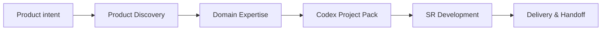

# Aurora SR Method Codex Pack

[](https://github.com/syl2042/Aurora_SR_method_codex_pack/stargazers)
[](https://github.com/syl2042/Aurora_SR_method_codex_pack/forks)
[](https://github.com/syl2042/Aurora_SR_method_codex_pack/issues)
[](https://github.com/syl2042/Aurora_SR_method_codex_pack/commits/main)
[](LICENSE)

**EN** · [Français](README.fr.md) · [Deutsch](README.de.md) · [Português](README.pt.md) · [Español](README.es.md)

[⭐ Star this repository](https://github.com/syl2042/Aurora_SR_method_codex_pack/stargazers) ·
[Documentation](https://docs.auroramind.fr/docs/SR_Method) ·
[Installation](INSTALLATION.md) ·
[Install with Codex](prompts/en/00_install_codex_environment.md) ·
[Upgrade](prompts/en/05_upgrade_codex_environment.md) ·
[Verify](prompts/en/06_verify_sr_installation.md)

---

## What it is

**Aurora SR Method Codex Pack** is a public pack for installing the **SR Method** into a software project so Codex works inside an explicit, verifiable, and transferable operating frame.

**SR** means **Specification Runtime**.

The central idea is simple:

> **AI is free in exploration, but constrained in execution.**

Codex can analyze, diagnose, propose, and compare. But as soon as it needs to modify a file, change a dependency, create a migration, touch configuration, push to GitHub, or make a business decision, it must work inside a validated scope, with evidence, checks, and resumable memory.

```text
Clone the pack
-> Paste a prompt into Codex
-> Install the SR Method in the target project
-> Verify the installation
-> Work through governed lots
-> Test, document, hand off
```

---

## Why use this pack?

Codex is powerful, but on a real project it can quickly become risky when context is unclear:

- it codes before reading the sources;
- it confuses hypotheses with verified facts;
- it expands scope without validation;
- it forgets previous decisions;
- it closes a lot without real user testing;
- it becomes hard to resume in a new session.

The SR Method brings project-work discipline: **clear objective, sources read, short lots, validation gates, SR contracts, task memory, and clean handoff**.

It turns Codex into a more reliable development teammate: not a one-off code generator, but an agent that works inside the repository with method.

---

## Who is it for?

This pack is mainly for:

| Profile | Need covered |
|---|---|
| Solo developer | Keep control over Codex, even across several long sessions. |
| Tech lead | Standardize how Codex reads, modifies, verifies, and documents. |
| SaaS founder | Move a product forward quickly without losing vision, scope, and decisions. |
| AI trainer / consultant | Demonstrate a reproducible method for AI-assisted development. |
| Product-tech team | Make Codex work auditable, testable, and transferable. |

---

## What the SR Method changes in practice

### Without an SR frame

```text
Broad prompt
-> Codex interprets
-> Codex modifies
-> Final summary
-> Hard to know what is proven, tested, or still risky
```

### With an SR frame

```text
User intent
-> Source reading
-> Proposed scope
-> Human validation
-> Short lot
-> SR gates
-> Checks
-> User E2E tests
-> Resumable memory
-> Handoff
```

---

## Key principles

### 1. Prompt-first

The recommended path is not to run scripts manually.

You open Codex in the target project, paste the appropriate prompt, then Codex inspects the repository, proposes the scope, asks for validation, and runs useful scripts when needed.

### 2. Evidence before action

Before acting, Codex must read the available sources: SR files, real code, tests, logs, official documentation, RepoMap, or Knowledge Graph when available.

### 3. Short and verifiable lots

Development is split into named, bounded, traceable lots.

A lot is not `done` because Codex finished coding. It becomes `done` when the planned checks and, when needed, user E2E tests are validated.

### 4. Explicit human validation

Codex can analyze freely. But sensitive actions require validation: file modification, dependency change, migration, GitHub push, configuration, secret, business rule, or product decision.

### 5. Resumable memory

Every important session must leave usable traces: current state, decisions, sources read, files changed, checks, remaining risks, and the next resume prompt.

---

## The full workflow



| Step | Objective | Expected output |
|---|---|---|
| **1. Product Discovery** | Clarify the need before code. | Product vision, target users, V0, exclusions, risks. |
| **2. Domain Expertise** | Prevent Codex from treating the domain as generic CRUD. | Vocabulary, critical rules, sources of truth, LLM risks. |
| **3. Codex Project Pack** | Turn discovery into a Codex-ready dossier. | Brief, PRD, specs, architecture, data model, API, UX, tests, initial lots. |
| **4. SR Development** | Make Codex work by controlled lots inside the repository. | Executed, verified, documented, testable lot. |
| **5. Delivery & Handoff** | Deliver cleanly and enable resumption. | E2E tests, SR memory, contracts, risks, next step. |

---

## Quick start with Codex

### 1. Clone this repository

```bash
git clone https://github.com/syl2042/Aurora_SR_method_codex_pack.git
```

### 2. Open Codex in the target project

Move into the repository of the application where you want to install the SR Method.

### 3. Paste the installation prompt

Use the English prompt:

- [00_install_codex_environment.md](prompts/en/00_install_codex_environment.md)

Codex must:

1. inspect the project;
2. check whether SR is already installed;
3. install only the expected SR files;
4. avoid modifying application code;
5. run the checks;
6. produce a final report;
7. stop before any application development.

### 4. Verify the installation

Recommended prompt:

- [06_verify_sr_installation.md](prompts/en/06_verify_sr_installation.md)

### 5. Start an SR session

Recommended prompt:

- [01_start_sr_session.md](prompts/en/01_start_sr_session.md)

---

## Main prompts

| Action | Prompt |
|---|---|
| Install the SR Method | [00_install_codex_environment.md](prompts/en/00_install_codex_environment.md) |
| Start an SR session | [01_start_sr_session.md](prompts/en/01_start_sr_session.md) |
| Upgrade the SR Method | [05_upgrade_codex_environment.md](prompts/en/05_upgrade_codex_environment.md) |
| Verify the installation | [06_verify_sr_installation.md](prompts/en/06_verify_sr_installation.md) |
| Realign state after upgrade | [07_realign_sr_state_after_upgrade.md](prompts/07_realign_sr_state_after_upgrade.md) |
| Define runtime AI agents | [15_define_runtime_agents.md](prompts/en/15_define_runtime_agents.md) |

---

## Short prompt example to frame a lot

```text
Frame this need as an SR lot.

Do not code anything.

Give me:
- the verifiable objective;
- included scope;
- out of scope;
- assumptions;
- sources to read;
- candidate files;
- risks;
- planned checks;
- user E2E tests;
- recommended lot status.

Wait for my validation before any modification.
```

---

## Working by lots

The lot is the central work unit of the SR Method.

```text
proposed -> planned -> validated -> in_progress -> user_testing -> done
```

When there is a problem:

```text
user_testing -> reopened -> in_progress -> user_testing -> done
```

| Status | Meaning |
|---|---|
| `proposed` | Idea or feedback to frame. |
| `planned` | Structured lot, not yet validated. |
| `validated` | Lot validated by the user and executable. |
| `in_progress` | Codex is executing the lot. |
| `user_testing` | Code is delivered, but real user testing is expected. |
| `done` | Lot is checked and validated according to the planned criteria. |
| `reopened` | Lot reopened after bug, omission, or regression. |
| `blocked` | Lot blocked by a decision, access, or missing source. |
| `superseded` | Lot replaced by another lot or decision. |

---

## SR gates

A **gate** is a control that prevents Codex from moving forward on assumptions or delivering without evidence.

| Gate | Purpose |
|---|---|
| **Evidence Gate** | Check sources before planning. |
| **Fact Gate** | Prevent unproven conclusions. |
| **Knowledge Gate** | Build the change map from RepoMap, KG, or real code. |
| **Scope Gate** | Stay strictly inside the validated scope. |
| **Verification Gate** | Prove the change works or explain why verification is impossible. |
| **Design Gate** | Control UI/UX quality when the interface is involved. |
| **Context Budget Gate** | Prevent context loss and prepare resumption. |

Example of a good Fact Gate reflex:

```text
I cannot conclude without evidence.
I must read the relevant file, logs, tests, or official documentation before stating the cause.
```

---

## What the pack installs in a target project

After installation, the target project may contain:

```text
AGENTS.md
docs/CURRENT_STATE.md
docs/codex/SR_BOOTSTRAP.md
docs/codex/PROJECT_PROFILE.yaml
docs/codex/SKILL_DIGEST.md
docs/codex/SKILL_MAP.md
docs/codex/SR_LOTS.yaml
docs/codex/SR_INBOX.yaml
docs/codex/CODEBASE_MAP.md
docs/codex/tasks/
docs/codex/project-skills/
scripts/codex/
```

These files orient Codex, structure lots, preserve memory, validate contracts, and prepare resumptions.

They never replace reading the real code: **code, tests, and logs decide**.

---

## Public repository contents

This repository is a **public source pack**. It is meant to be cloned, then installed into target projects.

```text
core/             Canonical English method core and templates
prompts/          Root prompts and multilingual entry points
scripts/          Installation, audit, and validation scripts
skills-method/    Reusable Codex method skills
blueprints/       Templates for lots, inbox, tasks, and skills
profiles/         Generic installation profiles
project-skills/   Template location for project-local skills
adr/              ADR template
tasks/_TEMPLATE/  Task memory template
```

The public repository must not publish target-project state files:

```text
AGENTS.md
DESIGN.md
docs/CURRENT_STATE.md
docs/codex/
docs/codex/tasks/
tasks/
*.docx
local handoffs
client paths
project data
secrets
```

---

## SR contracts

The SR Method uses contracts to verify that the loop was followed.

| Contract | Question answered |
|---|---|
| `loop_contract.json` | Did Codex apply the SR loop correctly? |
| `sr_contract.json` | Are all validated user requests covered or explicitly out of scope? |

A lot must not move to `done` if a validated request remains open without clear treatment.

Typical validation commands:

```bash
python3 scripts/codex/validate_loop_contract.py --file docs/codex/tasks/YYYY-MM-DD_slug/loop_contract.json
python3 scripts/codex/validate_sr_contract.py --file docs/codex/tasks/YYYY-MM-DD_slug/sr_contract.json
```

---

## Codex skills

The method distinguishes three skill families.

### Method skills

They frame how work is done:

- diagnosis;
- planning;
- architecture;
- TDD;
- diff review;
- RepoMap maintenance;
- lot execution;
- terminal context optimization.

### Domain skills

They describe a specific domain so Codex does not invent the rules.

A good domain skill contains:

- domain vocabulary;
- non-negotiable rules;
- sources of truth;
- likely LLM mistakes;
- expected patterns;
- anti-patterns;
- checklist before closure.

### Runtime skills

They belong to application AI agents. They describe versionable behaviors loaded by a runtime: careful diagnosis, support writing, escalation, quality review, brand tone, and more.

---

## SR Agent Method

The **SR Agent Method** is an optional extension for designing AI agents embedded in business applications.

It is not a framework and does not replace LangChain, LangGraph, LlamaIndex, PydanticAI, CrewAI, or agent SDKs.

It defines the agent's **application contract** before implementation:

- role;
- inputs;
- outputs;
- permissions;
- authorized data;
- usable tools;
- validations;
- logs;
- risks;
- activation status.

Strong principle:

> JSON produced by an LLM is not reliable application data until it has been validated on the backend side.

Recommended flow:

```text
Typed model
-> JSON Schema exposed to the LLM
-> LLM JSON response
-> strict runtime validation
-> accepted application object or controlled error
```

In Python, validation must rely on **Pydantic** or an equivalent validator.

Prudence rules:

- no free SQL generated and executed by the LLM;
- structured and validated application outputs;
- critical actions subject to human validation;
- agent inactive by default until its contract is validated.

---

## SR Core mode and SR Nexus KG mode

The SR Method can operate at two levels.

| Mode | Description |
|---|---|
| **SR Core** | Codex relies on SR files, RepoMap, and direct code reading. |
| **SR Nexus KG** | A Nexus Knowledge Graph helps identify files, routes, components, services, dependencies, tests, and risk areas. |

In both cases, the principle remains the same:

> The graph or map guides the search, but the real code decides.

---

## Technical fallback commands

The normal path is **prompt-first**. The commands below are useful for fallback, audit, or automation.

### Install from a local source

```bash
export SR_PACK_SOURCE="$HOME/aurora-sr-method-pack"

git clone https://github.com/syl2042/Aurora_SR_method_codex_pack.git "$SR_PACK_SOURCE"

python3 "$SR_PACK_SOURCE/scripts/install_codex_pack.py" \
  --source "$SR_PACK_SOURCE" \
  --target /path/to/project \
  --profile default \
  --write
```

### Verify the source pack

From this repository:

```bash
python3 scripts/codex/verify_codex_pack.py
python3 scripts/codex/audit_codex_pack.py --root . --json
git diff --check
```

### Verify an installed project

From the target project, depending on present files:

```bash
python3 scripts/codex/verify_codex_pack.py
python3 scripts/codex/audit_codex_pack.py --json
python3 scripts/codex/sr_post_install_check.py --root . --json
python3 scripts/codex/find_next_session_prompt.py --root . --json
python3 scripts/codex/audit_sr_project.py --root . --json
python3 scripts/codex/validate_lot_contract.py --file docs/codex/SR_LOTS.yaml
python3 scripts/codex/audit_sr_task_contracts.py --root . --json
git diff --check
git status --short
```

---

## Public release hygiene

Before publishing a fork or release, check that no target-project data was included by mistake.

```bash
git ls-tree -r --name-only HEAD | grep -E '(^docs/codex/|^tasks/|\.docx$|^AGENTS.md$|^DESIGN.md$|CURRENT_STATE)'
git grep -n -I -E 'absolute_path|customer_project|client_project|internal_project' HEAD -- .
```

These commands must return no publication blocker.

---

## Language policy

The technical core of the SR Method remains maintained in **canonical English** to preserve a stable and coherent base.

Developer entry points are available in multiple languages:

- README;
- installation guides;
- copy-paste Codex prompts;
- upgrade, verification, resume, and runtime-agent prompts.

An installed project can ask Codex to speak with the user in English. The technical method remains canonical in English.

---

## What this pack is not

This pack is not:

- an agentic framework;
- an automatic application generator without supervision;
- a guarantee that Codex will never make mistakes;
- a replacement for tests;
- a replacement for product validation;
- a tool that allows AI to decide business rules alone.

It is a controlled execution method to make AI-assisted development more reliable, more auditable, and easier to resume.

---

## Documentation

Main documentation:

- [SR Method](https://docs.auroramind.fr/docs/SR_Method)
- [English documentation](https://docs.auroramind.fr/docs/SR_Method/en)

Useful pages:

- Understand the SR Method
- Start with Codex
- Work by lots
- Gates and validation
- Codex skills
- Codex Project Pack
- Main SR files
- SR contracts
- Runtime AI agents
- Closure, E2E tests, and GitHub

---

## License

This repository is published under the **MIT** license.

See [LICENSE](LICENSE).

---

## Contributing

Contributions are welcome when they strengthen the method without making it heavier.

Useful areas:

- improve multilingual prompts;
- add verification checklists;
- enrich lot templates;
- improve audit scripts;
- document real use cases;
- propose reusable method or domain skills.

Before contributing, keep the project philosophy in mind:

> less improvisation, more evidence, more resumability.
