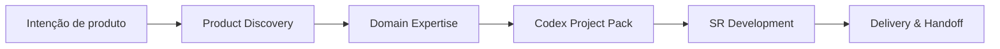

# Aurora SR Method Codex Pack

[](https://github.com/syl2042/Aurora_SR_method_codex_pack/stargazers)
[](https://github.com/syl2042/Aurora_SR_method_codex_pack/forks)
[](https://github.com/syl2042/Aurora_SR_method_codex_pack/issues)
[](https://github.com/syl2042/Aurora_SR_method_codex_pack/commits/main)
[](LICENSE)

[English](README.md) · [Français](README.fr.md) · [Deutsch](README.de.md) · **PT** · [Español](README.es.md)

[⭐ Dar uma estrela](https://github.com/syl2042/Aurora_SR_method_codex_pack/stargazers) ·
[Documentação](https://docs.auroramind.fr/docs/SR_Method) ·
[Instalação](INSTALLATION.pt.md) ·
[Instalar com Codex](prompts/pt/00_install_codex_environment.md) ·
[Atualizar](prompts/pt/05_upgrade_codex_environment.md) ·
[Verificar](prompts/pt/06_verify_sr_installation.md)

---

## O que é

**Aurora SR Method Codex Pack** é um pack público para instalar a **SR Method** em um projeto de software, para que o Codex trabalhe dentro de um quadro explícito, verificável e transmissível.

**SR** significa **Specification Runtime**.

A ideia central é simples:

> **A IA é livre na exploração, mas limitada na execução.**

O Codex pode analisar, diagnosticar, propor e comparar. Mas, assim que precisa modificar um arquivo, alterar uma dependência, criar uma migração, tocar configuração, fazer push para GitHub ou tomar uma decisão de negócio, deve trabalhar dentro de um escopo validado, com evidências, verificações e memória de retomada.

```text
Clonar o pack
-> Colar um prompt no Codex
-> Instalar a SR Method no projeto alvo
-> Verificar a instalação
-> Trabalhar por lots governados
-> Testar, documentar, transmitir
```

---

## Por que usar este pack?

O Codex é poderoso, mas em um projeto real pode se tornar arriscado quando o contexto está confuso:

- ele codifica antes de ler as fontes;
- confunde hipótese com fato verificado;
- amplia o escopo sem validação;
- esquece decisões anteriores;
- encerra um lot sem teste real do usuário;
- torna-se difícil de retomar em uma nova sessão.

A SR Method traz disciplina de trabalho de projeto: **objetivo claro, fontes lidas, lots curtos, gates de validação, contratos SR, task memory e handoff limpo**.

Ela transforma o Codex em um colega de desenvolvimento mais confiável: não um gerador de código pontual, mas um agente que trabalha no repositório com método.

---

## Para quem?

Este pack se destina principalmente a:

| Perfil | Necessidade coberta |
|---|---|
| Desenvolvedor solo | Manter controle sobre o Codex, mesmo em várias sessões longas. |
| Tech lead | Padronizar como o Codex lê, modifica, verifica e documenta. |
| Fundador SaaS | Avançar rápido no produto sem perder visão, escopo e decisões. |
| Formador / consultor IA | Mostrar um método reprodutível para desenvolvimento assistido por IA. |
| Equipe produto-tech | Tornar o trabalho do Codex auditável, testável e transmissível. |

---

## O que a SR Method muda concretamente

### Sem quadro SR

```text
Prompt amplo
-> Codex interpreta
-> Codex modifica
-> Resumo final
-> Difícil saber o que está provado, testado ou ainda arriscado
```

### Com quadro SR

```text
Intenção do usuário
-> Leitura das fontes
-> Escopo proposto
-> Validação humana
-> Lot curto
-> Gates SR
-> Verificações
-> Testes E2E do usuário
-> Memória de retomada
-> Handoff
```

---

## Princípios-chave

### 1. Prompt-first

O percurso recomendado não é executar scripts manualmente.

Você abre o Codex no projeto alvo, cola o prompt adequado, então o Codex inspeciona o repositório, propõe o escopo, pede validação e executa os scripts úteis quando necessário.

### 2. Evidence before action

Antes de agir, o Codex deve ler as fontes disponíveis: arquivos SR, código real, testes, logs, documentação oficial, RepoMap ou Knowledge Graph quando disponível.

### 3. Lots curtos e verificáveis

O desenvolvimento é dividido em lots nomeados, limitados e rastreáveis.

Um lot não está `done` porque o Codex terminou de codificar. Ele fica `done` quando as verificações previstas e, se necessário, os testes E2E do usuário são validados.

### 4. Validação humana explícita

O Codex pode analisar livremente. Mas ações sensíveis exigem validação: modificação de arquivo, alteração de dependência, migração, push GitHub, configuração, segredo, regra de negócio ou decisão de produto.

### 5. Memória de retomada

Cada sessão importante deve deixar rastros utilizáveis: estado atual, decisões, fontes lidas, arquivos modificados, verificações, riscos restantes e próximo prompt de retomada.

---

## O que muda na 3.0.4

A versão `3.0.4` reforça a SR para funções estruturantes que surgem durante o desenvolvimento.

Quando uma nova função, correção ou descoberta pode afetar mais do que o lot atual, o Codex agora deve:

- aplicar o **Backlog Mutation Gate** para decidir se `SR_INBOX.yaml` ou `SR_LOTS.yaml` precisa ser atualizado;
- aplicar o **Global Impact Gate** antes de codificar, verificando impacto em fluxos de produto, dados, permissões, APIs/serviços, UI, testes, migrações, riscos e lots existentes;
- executar a **Lot Dependency Reconciliation** para classificar lots afetados como `impacted`, `blocked_by`, `reopened`, `superseded`, `split_required`, `depends_on` ou `unaffected`;
- documentar `no_backlog_mutation_required` quando nenhuma mudança de backlog for necessária.

Assim, a SR permanece agnóstica ao projeto enquanto evita que impactos transversais importantes fiquem implícitos.

---

## Workflow completo



| Etapa | Objetivo | Saída esperada |
|---|---|---|
| **1. Product Discovery** | Clarificar a necessidade antes do código. | Visão de produto, alvo, V0, exclusões, riscos. |
| **2. Domain Expertise** | Evitar que Codex trate o domínio como CRUD genérico. | Vocabulário, regras críticas, fontes de verdade, riscos LLM. |
| **3. Codex Project Pack** | Transformar a discovery em dossiê utilizável pelo Codex. | Brief, PRD, specs, arquitetura, data model, API, UX, testes, lots iniciais. |
| **4. SR Development** | Fazer o Codex trabalhar por lots controlados no repositório. | Lot executado, verificado, documentado e testável. |
| **5. Delivery & Handoff** | Entregar limpo e permitir retomada. | Testes E2E, memória SR, contratos, riscos, próxima etapa. |

---

## Início rápido com Codex

### 1. Clonar este repositório

```bash
git clone https://github.com/syl2042/Aurora_SR_method_codex_pack.git
```

### 2. Abrir o Codex no projeto alvo

Entre no repositório da aplicação onde deseja instalar a SR Method.

### 3. Colar o prompt de instalação

Use o prompt em português:

- [00_install_codex_environment.md](prompts/pt/00_install_codex_environment.md)

O Codex deve:

1. inspecionar o projeto;
2. verificar se SR já está instalada;
3. instalar apenas os arquivos SR esperados;
4. não modificar código da aplicação;
5. executar as verificações;
6. produzir um relatório final;
7. parar antes de qualquer desenvolvimento aplicativo.

### 4. Verificar a instalação

Prompt recomendado:

- [06_verify_sr_installation.md](prompts/pt/06_verify_sr_installation.md)

### 5. Iniciar uma sessão SR

Prompt recomendado:

- [01_start_sr_session.md](prompts/pt/01_start_sr_session.md)

---

## Prompts principais

| Ação | Prompt |
|---|---|
| Instalar a SR Method | [00_install_codex_environment.md](prompts/pt/00_install_codex_environment.md) |
| Iniciar uma sessão SR | [01_start_sr_session.md](prompts/pt/01_start_sr_session.md) |
| Atualizar a SR Method | [05_upgrade_codex_environment.md](prompts/pt/05_upgrade_codex_environment.md) |
| Verificar a instalação | [06_verify_sr_installation.md](prompts/pt/06_verify_sr_installation.md) |
| Realinhar o estado após upgrade | [07_realign_sr_state_after_upgrade.md](prompts/07_realign_sr_state_after_upgrade.md) |
| Definir agentes IA runtime | [15_define_runtime_agents.md](prompts/pt/15_define_runtime_agents.md) |

---

## Exemplo de prompt curto para enquadrar um lot

```text
Enquadre esta necessidade como um lot SR.

Não codifique nada.

Dê-me:
- o objetivo verificável;
- o escopo incluído;
- o fora de escopo;
- as hipóteses;
- as fontes a ler;
- os arquivos candidatos;
- os riscos;
- as verificações previstas;
- os testes E2E do usuário;
- o status recomendado do lot.

Aguarde minha validação antes de qualquer modificação.
```

---

## Trabalhar por lots

O lot é a unidade central de trabalho da SR Method.

```text
proposed -> planned -> validated -> in_progress -> user_testing -> done
```

Em caso de problema:

```text
user_testing -> reopened -> in_progress -> user_testing -> done
```

| Status | Significado |
|---|---|
| `proposed` | Ideia ou retorno a enquadrar. |
| `planned` | Lot estruturado, mas ainda não validado. |
| `validated` | Lot validado pelo usuário e executável. |
| `in_progress` | Codex executa o lot. |
| `user_testing` | O código foi entregue, mas o teste real do usuário é esperado. |
| `done` | O lot foi verificado e validado conforme os critérios previstos. |
| `reopened` | O lot foi reaberto após bug, omissão ou regressão. |
| `blocked` | O lot está bloqueado por decisão, acesso ou fonte ausente. |
| `superseded` | O lot foi substituído por outro lot ou decisão. |

---

## Gates SR

Um **gate** é um controle que impede o Codex de avançar sobre suposições ou entregar sem evidência.

| Gate | Objetivo |
|---|---|
| **Evidence Gate** | Verificar fontes antes de planejar. |
| **Fact Gate** | Impedir conclusões não comprovadas. |
| **Knowledge Gate** | Construir o mapa da mudança a partir de RepoMap, KG ou código real. |
| **Scope Gate** | Permanecer estritamente no escopo validado. |
| **Verification Gate** | Provar que a mudança funciona ou explicar por que a verificação é impossível. |
| **Design Gate** | Controlar a qualidade UI/UX quando a interface está envolvida. |
| **Context Budget Gate** | Prevenir perda de contexto e preparar retomada. |

Exemplo de bom reflexo Fact Gate:

```text
Não posso concluir sem evidência.
Devo ler o arquivo relevante, logs, testes ou documentação oficial antes de afirmar a causa.
```

---

## O que o pack instala em um projeto alvo

Após a instalação, o projeto alvo pode conter:

```text
AGENTS.md
docs/CURRENT_STATE.md
docs/codex/SR_BOOTSTRAP.md
docs/codex/PROJECT_PROFILE.yaml
docs/codex/SKILL_DIGEST.md
docs/codex/SKILL_MAP.md
docs/codex/SR_LOTS.yaml
docs/codex/SR_INBOX.yaml
docs/codex/CODEBASE_MAP.md
docs/codex/tasks/
docs/codex/project-skills/
scripts/codex/
```

Esses arquivos orientam o Codex, estruturam lots, preservam memória, validam contratos e preparam retomadas.

Eles nunca substituem a leitura do código real: **o código, os testes e os logs decidem**.

---

## Conteúdo do repositório público

Este repositório é um **pack fonte público**. Ele deve ser clonado e depois instalado em projetos alvo.

```text
core/             Núcleo canônico em inglês e templates
prompts/          Prompts raiz e entradas multilíngues
scripts/          Scripts de instalação, auditoria e validação
skills-method/    Skills método Codex reutilizáveis
blueprints/       Templates de lots, inbox, tasks e skills
profiles/         Perfis genéricos de instalação
project-skills/   Local modelo para skills locais de projeto
adr/              Template ADR
tasks/_TEMPLATE/  Template de memória de tarefa
```

O repositório público não deve publicar arquivos de estado próprios de um projeto alvo:

```text
AGENTS.md
DESIGN.md
docs/CURRENT_STATE.md
docs/codex/
docs/codex/tasks/
tasks/
*.docx
handoffs locais
caminhos de clientes
dados de projeto
segredos
```

---

## Contratos SR

A SR Method usa contratos para verificar se o loop foi respeitado.

| Contrato | Pergunta respondida |
|---|---|
| `loop_contract.json` | Codex aplicou corretamente o loop SR? |
| `sr_contract.json` | Todas as solicitações validadas do usuário foram cobertas ou explicitamente retiradas do lot? |

Um lot não deve passar para `done` se uma solicitação validada permanecer aberta sem tratamento claro.

Comandos típicos de validação:

```bash
python3 scripts/codex/validate_loop_contract.py --file docs/codex/tasks/YYYY-MM-DD_slug/loop_contract.json
python3 scripts/codex/validate_sr_contract.py --file docs/codex/tasks/YYYY-MM-DD_slug/sr_contract.json
```

---

## Skills Codex

O método distingue três famílias de skills.

### Skills método

Elas enquadram a maneira de trabalhar:

- diagnóstico;
- planejamento;
- arquitetura;
- TDD;
- revisão de diff;
- manutenção de RepoMap;
- execução de lots;
- otimização do contexto terminal.

### Skills de domínio

Elas descrevem um domínio específico para evitar que Codex invente as regras.

Uma boa skill de domínio contém:

- vocabulário do domínio;
- regras não negociáveis;
- fontes de verdade;
- erros prováveis de um LLM;
- patterns esperados;
- anti-patterns;
- checklist antes do encerramento.

### Skills runtime

Elas pertencem aos agentes IA de aplicação. Descrevem comportamentos versionáveis carregados por um runtime: diagnóstico prudente, redação de suporte, escalada, revisão de qualidade, tom de marca etc.

---

## SR Agent Method

A **SR Agent Method** é uma extensão opcional para projetar agentes IA integrados em aplicações de negócio.

Ela não é um framework e não substitui LangChain, LangGraph, LlamaIndex, PydanticAI, CrewAI ou SDKs de agentes.

Ela define o **contrato aplicativo** do agente antes da implementação:

- papel;
- entradas;
- saídas;
- permissões;
- dados autorizados;
- tools utilizáveis;
- validações;
- logs;
- riscos;
- status de ativação.

Princípio forte:

> Um JSON produzido por um LLM não é dado aplicativo confiável enquanto não for validado no backend.

Fluxo recomendado:

```text
Modelo tipado
-> JSON Schema exposto ao LLM
-> resposta JSON do LLM
-> validação runtime estrita
-> objeto aplicativo aceito ou erro controlado
```

Em Python, a validação deve se apoiar em **Pydantic** ou validador equivalente.

Regras de prudência:

- nenhum SQL livre gerado e executado pelo LLM;
- saídas aplicativas estruturadas e validadas;
- ações críticas sujeitas à validação humana;
- agente inativo por padrão até que seu contrato seja validado.

---

## Modo SR Core e modo SR Nexus KG

A SR Method pode funcionar em dois níveis.

| Modo | Descrição |
|---|---|
| **SR Core** | Codex se apoia nos arquivos SR, RepoMap e leitura direta do código. |
| **SR Nexus KG** | Um Knowledge Graph Nexus ajuda a identificar arquivos, rotas, componentes, serviços, dependências, testes e zonas de risco. |

Em ambos os casos, o princípio continua o mesmo:

> O grafo ou o mapa orientam a busca, mas o código real decide.

---

## Comandos técnicos de fallback

O percurso normal é **prompt-first**. Os comandos abaixo são úteis em fallback, auditoria ou automação.

### Instalar a partir de uma fonte local

```bash
export SR_PACK_SOURCE="$HOME/aurora-sr-method-pack"

git clone https://github.com/syl2042/Aurora_SR_method_codex_pack.git "$SR_PACK_SOURCE"

python3 "$SR_PACK_SOURCE/scripts/install_codex_pack.py" \
  --source "$SR_PACK_SOURCE" \
  --target /path/to/project \
  --profile default \
  --write
```

### Verificar o pack fonte

A partir deste repositório:

```bash
python3 scripts/codex/verify_codex_pack.py
python3 scripts/codex/audit_codex_pack.py --root . --json
git diff --check
```

### Verificar um projeto instalado

A partir do projeto alvo, conforme os arquivos presentes:

```bash
python3 scripts/codex/verify_codex_pack.py
python3 scripts/codex/audit_codex_pack.py --json
python3 scripts/codex/sr_post_install_check.py --root . --json
python3 scripts/codex/find_next_session_prompt.py --root . --json
python3 scripts/codex/audit_sr_project.py --root . --json
python3 scripts/codex/validate_lot_contract.py --file docs/codex/SR_LOTS.yaml
python3 scripts/codex/audit_sr_task_contracts.py --root . --json
git diff --check
git status --short
```

---

## Higiene antes da publicação pública

Antes de publicar um fork ou release, verifique que nenhum dado de projeto alvo foi incluído por erro.

```bash
git ls-tree -r --name-only HEAD | grep -E '(^docs/codex/|^tasks/|\.docx$|^AGENTS.md$|^DESIGN.md$|CURRENT_STATE)'
git grep -n -I -E 'absolute_path|customer_project|client_project|internal_project' HEAD -- .
```

Esses comandos não devem retornar nenhum bloqueio de publicação.

---

## Política de idioma

O núcleo técnico da SR Method continua mantido em **inglês canônico** para preservar uma base estável e coerente.

Os pontos de entrada para desenvolvedores estão disponíveis em vários idiomas:

- README;
- guias de instalação;
- prompts Codex copiáveis;
- prompts de atualização, verificação, retomada e agentes runtime.

Um projeto instalado pode pedir ao Codex para falar com o usuário em português. O método técnico continua canônico em inglês.

---

## O que este pack não é

Este pack não é:

- um framework agentic;
- um gerador automático de aplicação sem supervisão;
- uma garantia de que Codex nunca errará;
- um substituto dos testes;
- um substituto da validação de produto;
- uma ferramenta que autoriza a IA a decidir sozinha regras de negócio.

É um método de execução controlada para tornar o desenvolvimento assistido por IA mais confiável, mais auditável e mais fácil de retomar.

---

## Documentação

Documentação principal:

- [SR Method](https://docs.auroramind.fr/docs/SR_Method)
- [Documentação em inglês](https://docs.auroramind.fr/docs/SR_Method/en)

Páginas úteis:

- Entender a SR Method
- Começar com Codex
- Trabalhar por lots
- Gates e validação
- Skills Codex
- Codex Project Pack
- Arquivos SR principais
- Contratos SR
- Agentes IA runtime
- Encerramento, testes E2E e GitHub

---

## Licença

Este repositório é publicado sob a licença **MIT**.

Veja [LICENSE](LICENSE).

---

## Contribuir

Contribuições são bem-vindas quando fortalecem o método sem torná-lo mais pesado.

Áreas úteis:

- melhorar prompts multilíngues;
- adicionar checklists de verificação;
- enriquecer templates de lots;
- melhorar scripts de auditoria;
- documentar casos reais de uso;
- propor skills método ou domínio reutilizáveis.

Antes de contribuir, mantenha em mente a filosofia do projeto:

> menos improvisação, mais evidências, mais retomada.
